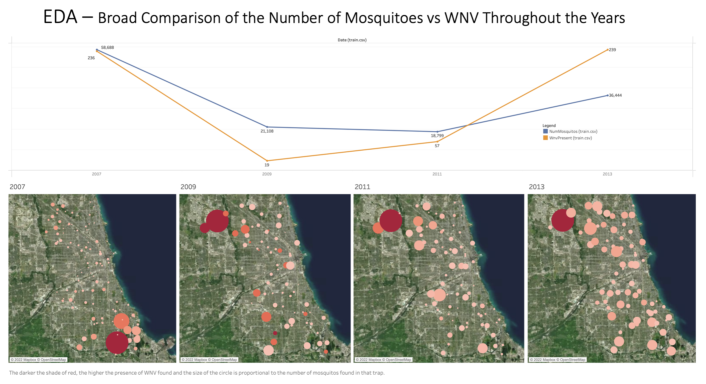
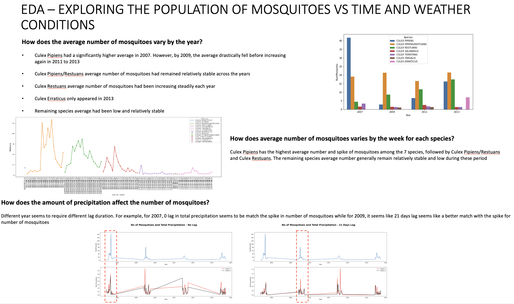
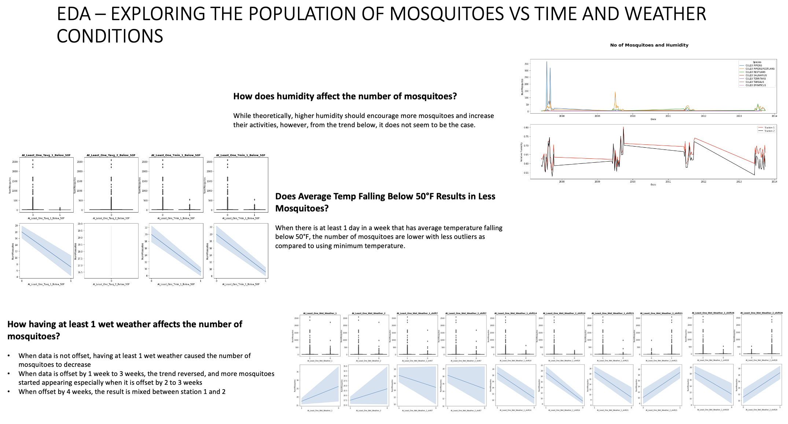
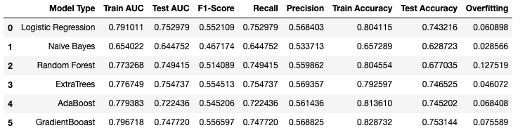

#  DSIF4 - Kaggle Competition

<h2 align="center">:microbe::microbe: West Nile Virus Prediction (Chicago) :microbe::microbe:</h2>

## Content
- [Introduction](#intro)
- [Datasets](#ds)
- [EDA](#eda)
- [Machine Learning](#ml)
- [Conclusion](#conc)
- [Further Recommendations](#fr)

##   :test_tube: Introduction

This is the fourth data science project done for the General Assembly Data Science Immersive program. It was executed as a group effort using [Github](https://github.com/), [Deepnote](https://deepnote.com/home) and powerpoint to collaborate.

#### Problem Statement

"You just graduated from General Assembly Data Science Immersive program and managed to secure an interview with the Disease And Treatment Agency, division of Societal Cures In Epidemiology and New Creative Engineering (DATA-SCIENCE). You have been assigned into a group with other interviewees and was given a take home BI test. You will be required to work together and present as a group during the interview. Time to look at the test!

Due to the recent epidemic of West Nile Virus in the Windy City, we've had the Department of Public Health set up a surveillance and control system. We're hoping it will let us learn something from the mosquito population as we collect data over time. Pesticides are a necessary evil in the fight for public health and safety, not to mention expensive! We need to derive an effective plan to deploy pesticides throughout the city, and that is **exactly** where you come in!"

#### Stakeholders

Interviewers from the data science department. Some will be data scientists, biostatisticians and epidemiologists who will understand our models and metrics and will want more information. Others will be decision-makers, focusing almost exclusively on cost-benefit analysis.

##  :test_tube: Datasets

There were 3 datasets given
1. Spray - Tracking the date and location where the spray occurred.
2. Weather - A huge collection of data during including, temperature, humidity, daylight hours, wind speed etc. The full documentation can be found [here](https://www.kaggle.com/competitions/predict-west-nile-virus/data?select=noaa_weather_qclcd_documentation.pdf)
3. Train(and test) - The train and test datasets keeps track of the traps placed, their locations, the species of mosquito found in the traps and the number of Mosquitos infected with the West Nile virus

The datasets, along with description, can be found  on Kaggle [here](https://www.kaggle.com/c/predict-west-nile-virus/).

##  :test_tube: EDA

In-depth exploratory data analysis was conducted on all 3 datasets. here are just three snapshots from the presentation deck of information discovered:

For the full code and analysis done, feel free to look at the codes uploaded in [Part 2: EDA](./code/Part%202-%20EDA.ipynb)

##  :test_tube: Machine Learning

We trained the following models:

* Logistic Regression
* Naive Bayes
* Random Forest
* Extra Trees
* AdaBoost
* GradientBoost

The 'train_weather_weekly' dataset is split into 80% train and validation set, 20% test set. GridSearch CV is applied across 5 folds on the data, to find the best hyperparameters for all the models. We will also evaluate the results of each of the model to help us gain more perpective on the West Nile Virus.

Do note that the data is heavily imbalanced (the baseline score is ~94.12%). Thus, after determining the best hyperparameters for each of the model, we will re-fit the model using over-sampled data, which is obtained using SMOTE (Synthetic Minority Over-sampling Technique).

To determine the final model to use to perform the predictions in the test dataset, we will assess the models using the following metrics. We will primarily look at:
* AUC Score
* Training Score
* Test Score
* Recall
* Precision

Why do we want to look at AUC score then? As earlier stated, our dataset is heavily imbalanced and the baseline accuracy is ~94%. This means that, if our model predicts that every point is Wnv NOT present, our accuracy is 94%. Thus, accuracy is not the best metric for validation in this situation. AUC, on the other hand, utilizes probabilites of class prediction and provides an aggregate measure of performance across all possible classification thresholds. This allows us to be able to more precisely evaluate and compare the models.

Our final selected model is the GradientBoostingClassifier(max_depth=2, min_samples_leaf=2). After running this model on the test dataset, we achieved a Kaggle Score of 0.49709.

##  :test_tube: Conclusion

While the model chosen is roughly 75% accurate in detecting the West Nile Virus, it is better than the null model in a sense where null model just assume all traps have no WNV present.

Although the model is unable to predict at a very high accuracy rate (e.g. 90+%), we should still conduct spray at those predicted spots. 
This is despite that the spray train analysis seemingly imply that it is not an effective method.
Reasons being, we were not sure how about the size of the spray area, exact weather condition at the time of spray, how was the spray conducted and most traps were not placed in the spray area.

Based on our analysis of the data, the WNV is more active during higher temperatures, shorter daylight hours and during wet weather conditions. As we tune the model further and collect more data, the model would be able to predict with even higher accuracy the possible presence of the WNV and preventive measures can be taken ahead of time.

##  :test_tube: Further Recommendations

We dropped the 'NumMosquitos' column as one of the features of our model as we were unable to create a good enough linear regression model to predict the 'NumMosquitos' in our test dataset. Moving forward, we can try to create a classification model instead of a Regression model, since 'NumMosquitos' will always be an integer value. So, Class 1 = 1 Mosquito, Class 2 = 2 Mosquitos, Class 3 = 3 Mosquitos etc. If our results are good, we can then look to include 'NumMosquios' as one of the features of our final selected model.

Furthermore, we can also look to include how densely populated each of the location is as part of our features. This is because, it could be that areas with a denser human population would experience a higher number of mosquitos in the area since mosquitoes feed off the blood of humans. This would increase the probability of the WNV virus too since there are more humans to transmit the virus to.

Additionally, the features/layouts of the location might be a significant factor too. Presence of forest areas, water sources, type of buildings are some examples that might affect the breeding of mosquitos, so we can look to include these features in the future to further improve our model.
